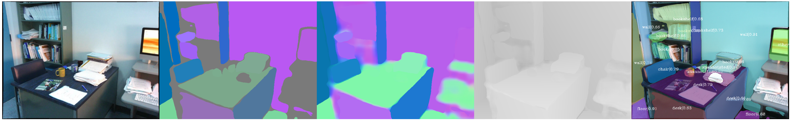
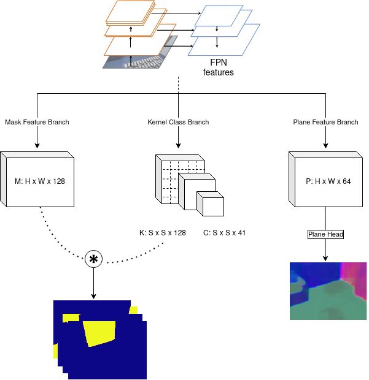
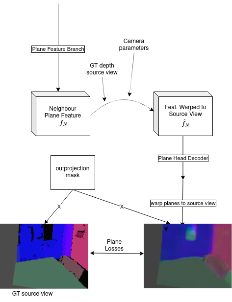

# SOLOPlanes

This is the official implementation for [Multi-task Planar Reconstruction with Feature Warping Guidance](https://arxiv.org/abs/2311.14981), published at VISAPP 2024.



| *Base Model* | *Feature warping* |
| ---- | ---- |
|         |         |


## Dataset
Download the [ScanNet](http://www.scan-net.org/ScanNet/) dataset and follow instructions to extract sens data for RGB, depth, and camera parameters. 

We use plane annotations from https://github.com/NVlabs/planercnn#training  

The data directory should look like:

    ScanNet
    ├── scans
    │   └── sceneXXXX_XX
    │       ├── annotation 
    │       ├── sens    
    │       └── ...
    └── ...


##  Getting started
```
conda create -n testsolop python=3.10
pip install -r requirements.txt

```

## Training
Download resnet-50 pretrained backbone [here](https://datacloud.hhi.fraunhofer.de/s/KSrM2Nai35gtDP4) and put in `pretrained/` folder

Edit config files with correct dataroot and settings

`python train_local.py`

## Evaluation
Download our pretrained model [here](https://datacloud.hhi.fraunhofer.de/s/qnYX3b7tzGEdR4e) 

Update the corresponding config file model.path

`python eval_models.py` 


## Acknowledgement
- _Modules adjusted from: https://github.com/OpenFirework/pytorch_solov2_
- _ScanNet dataset annotations from: https://github.com/NVlabs/planercnn_
